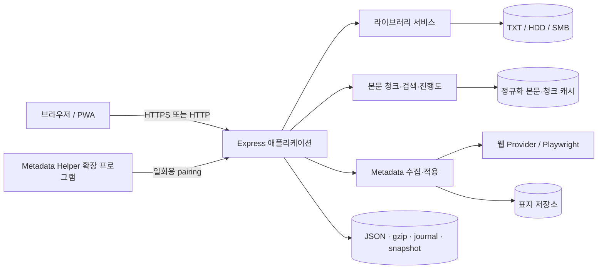

<p align="center">
  
</p>

<h1 align="center">TXT Reader Multi</h1>

<p align="center">
  대용량 TXT 웹소설 라이브러리를 서재·탐색기·Reader·Metadata 관리 화면으로 제공하는<br>
  Node.js 기반 다중 사용자 웹 애플리케이션
</p>

<p align="center">
  
  
  
  
  
</p>

---

## 개요

TXT Reader Multi는 로컬 디스크, 외장 HDD 또는 SMB에 보관한 대규모 TXT 소설 컬렉션을 웹에서 읽고 관리하기 위한 프로젝트입니다.

- 카드형 서재와 파일 탐색기형 보기
- 대용량 TXT 청크 Reader
- 진행도·북마크·검색·이어읽기 동기화
- 사용자별 권한, 테마와 독서 상태 분리
- 웹 메타데이터·표지 수집과 수동 입력
- Docker, PWA, reverse proxy 배포 지원
- JSON·gzip·journal 기반 영속 저장

현재 기준 버전은 **v682 / package 6.82.0 / build `rebuild-v682`**입니다.

## 주요 기능

| 영역 | 기능 |
|---|---|
| **서재** | 카드형, 트리형, Windows 탐색기형 보기, 즐겨찾기, 최근 항목, 검색, 정렬, 폴더 필터 |
| **Reader** | 대용량 TXT 청크 로딩, 자동 인코딩 감지, 글자·줄간격·폭·테마 설정, 블록·퍼센트 이동 |
| **독서 데이터** | 진행도, 북마크, 검색 위치, 이어읽기, 기기 간 충돌 처리, 사용자별 상태 저장 |
| **Metadata** | 네이버 시리즈, 카카오페이지, 노벨피아, 문피아, 조아라, 소설넷 및 추가 Provider |
| **표지** | Provider 표지 수집, content-addressed 저장, 크기·형식·호스트 검증, orphan 정리 |
| **사용자 관리** | Owner·일반 사용자, 라이브러리 ACL, Metadata 권한, 사용자별 테마와 데이터 격리 |
| **운영** | Owner 진단, 라이브러리 정리 후보, 재배치 스크립트, 감사 로그, 캐시 정리 |
| **배포** | 직접 Node.js 실행, Docker Compose, Cloudflare Tunnel·Nginx Proxy Manager 구성 문서 |
| **PWA** | 설치 가능한 앱 셸, Service Worker, 정적 자산 버전 handshake, private API 비캐시 |

## 화면 및 데이터 흐름



> 이 프로젝트는 SQLite를 사용하지 않습니다. 계정, 세션, 사용자 상태, Metadata와 캐시는 `data/` 아래의 JSON·gzip·JSONL·manifest·sidecar 파일에 저장됩니다.

## 빠른 시작 — Docker Compose

### 1. 환경 파일 준비

```bash
cp .env.example .env
mkdir -p data
```

`.env`에서 최소한 다음 값을 설정합니다.

```dotenv
LOGINID=owner_admin
LOGINPW=change_this_to_14_chars_or_more
SESSION_STORE_SECRET=change_this_to_a_long_random_secret_32_chars_or_more

LIBRARY_PATH=/absolute/path/to/novels
LIBRARY_MOUNT_MODE=ro

URL=http://localhost:3000
APP_ORIGIN=http://localhost:3000
```

- `data/`는 컨테이너의 UID 1000 또는 GID 0이 쓸 수 있어야 합니다.
- 이름 변경·이동·삭제·정리 기능을 사용할 때만 `LIBRARY_MOUNT_MODE=rw`로 변경하십시오.
- reverse proxy를 사용할 경우 `APP_ORIGIN`, `DEPLOYMENT_MODE`, `TRUSTED_PROXY_CIDRS`를 실제 구성에 맞게 설정하십시오.

### 2. 실행

```bash
docker compose up -d --build
```

### 3. 상태 확인

```bash
curl http://localhost:3000/healthz
```

브라우저에서 `http://localhost:3000`으로 접속한 뒤 `.env`의 Owner 계정으로 로그인합니다.

## 직접 Node.js 실행

### 요구 사항

- Node.js 20 이상
- npm
- 읽을 TXT 라이브러리 경로
- Metadata Playwright를 사용할 경우 Chromium 실행이 가능한 환경

```bash
npm ci --omit=dev
cp .env.example .env
node server.js --check-config
node server.js
```

기본 포트는 `3000`입니다.

## Metadata 수집

### 서버 수집

서버는 Provider별 HTTP 또는 Playwright 경로로 작품 제목, 작가, 소개, 장르, 태그, 연재 상태와 표지를 수집합니다.

기본 Provider:

- 소설넷
- 네이버 시리즈
- 카카오페이지
- 노벨피아
- 문피아
- 조아라

후보 저장은 32개 shard와 manifest를 사용하며 기본 resident 경계는 다음과 같습니다.

```dotenv
METADATA_MAX_CANDIDATES=20000
METADATA_MAX_CANDIDATES_PER_WORK=30
METADATA_MAX_CANDIDATE_RESIDENT_BYTES=50331648
METADATA_AUTO_APPLY_THRESHOLD=0.95
```

### 브라우저 Metadata Helper

현재 브라우저의 로그인·연령 인증 상태를 사용해야 하는 경우 다음 폴더를 압축 해제된 확장 프로그램으로 로드합니다.

```text
extensions/metadata-login-helper
```

Chrome, Whale 또는 Edge에서 개발자 모드를 켠 뒤 **압축해제된 확장 프로그램을 로드**하십시오.

기본 단축키:

- Windows/Linux: `Ctrl+Shift+Y`
- macOS: `Command+Shift+Y`

단축키 충돌 시 브라우저의 확장 프로그램 단축키 설정 화면에서 재지정할 수 있습니다.

## 사용자·권한·테마

- 로그인 화면은 인증 전용 Owner 팔레트를 사용합니다.
- 로그인 후 서재, Metadata, Reader는 현재 사용자 ID에 저장된 테마를 사용합니다.
- 사용자별 진행도, 북마크, 태그, 테마와 기기 상태는 서로 분리됩니다.
- Owner는 사용자별 라이브러리 접근 권한과 Metadata 접근 권한을 관리할 수 있습니다.
- `GET /api/theme-bootstrap`은 인증된 세션에 테마 관련 필드만 반환하며 `no-store` 정책을 사용합니다.

## 대용량 라이브러리 처리

- 서재 catalog API는 cursor 기반으로 페이지를 나눕니다.
- 대용량 본문은 전체 문자열을 브라우저와 메인 프로세스에 계속 복제하지 않고 정규화 캐시와 범위 읽기를 사용합니다.
- Worker queue와 동시성 상한을 적용하고, 포화 시 `503`과 `Retry-After`를 반환합니다.
- 파일 fingerprint는 제목·소개·본문 앞부분·파일 속성을 활용해 중복·판본 그룹을 보조합니다.
- 정규화 본문, 청크 인덱스와 최근 청크는 제한된 메모리·디스크 캐시를 사용합니다.

## 라이브러리 정리와 재배치

Owner 관리 페이지에서 정리 후보를 검토하고 PowerShell 스크립트를 생성할 수 있습니다.

v682 생성 스크립트는 Windows PowerShell 5.1과 호환되도록 `[System.IO.Path]::GetRelativePath()`를 사용하지 않습니다.

권장 절차:

1. 라이브러리를 백업합니다.
2. `LIBRARY_MOUNT_MODE=rw` 여부를 확인합니다.
3. 스크립트를 새로 다운로드합니다.
4. 먼저 dry-run 결과를 검토합니다.
5. 검토 후에만 `-Apply`를 사용합니다.

v681 이하에서 다운로드한 스크립트는 재사용하지 마십시오.

## 보안 기본값

- session, CSRF, strict origin과 라이브러리 ACL 적용
- trusted proxy CIDR과 전달 IP 유효성 검증
- private·loopback·link-local 외부 Metadata 주소 차단
- 표지 host allowlist, content type, magic byte와 크기 제한
- 민감한 Cookie, Authorization, raw HTML을 Helper payload에 포함하지 않음
- 주요 파일 경계에 `realpath`, `O_NOFOLLOW`, `fstat` 적용
- Docker 컨테이너 read-only root, capability 제거, `no-new-privileges`
- PWA private API 비캐시와 mixed-build executable fail-closed

운영 배포에서는 원본 서버의 WAN 직접 접근을 차단하고 reverse proxy 또는 Tunnel의 실제 socket peer CIDR만 신뢰하십시오.

## 저장 및 백업

운영 데이터는 기본적으로 `data/`에 저장됩니다.

주요 데이터:

```text
data/
├─ accounts.json
├─ sessions.json
├─ audit-log.jsonl
├─ users/ 또는 user-data/
├─ metadata-*.json / metadata-*.json.gz
├─ metadata-browser-profiles/
├─ normalized_content/
├─ chunk_indexes/
└─ content_chunks/
```

업데이트 전에 다음을 백업하십시오.

- `data/` 전체
- 라이브러리 원본 TXT
- `.env`
- reverse proxy와 Tunnel 설정

소스 ZIP만 교체하고 durable `data/` volume은 삭제하지 마십시오.

## 검증

```bash
npm run check
npm run verify:v682:targeted
npm run verify:v682:static
npm run smoke:quick
npm run release:verify
```

v682 clean-extract 검증 결과:

| 항목 | 결과 |
|---|---:|
| Targeted | 63 통과 / 환경 차단 4 / 코드 실패 0 |
| JavaScript 문법 | 1,348 / 1,348 |
| 필수 frontend module | 246 / 246 |
| gzip 동등성 | 336 / 336 |
| Brotli 동등성 | 336 / 336 |
| Manifest | 2,189 파일, 누락·초과·해시 불일치 0 |
| ZIP 안전성 | unsafe path·중복·case collision·symlink 0 |

다음 항목은 제공된 Linux 검증 환경에서 실행되지 않았습니다.

- 실제 Windows PowerShell 5.1 dry-run·Apply
- Quick·Full 전체 suite
- 실제 N100과 80,000개 HDD·SMB 라이브러리
- Docker·Podman 실배포
- Tunnel → NPM 운영 경계
- 실제 Provider 계정, 성인 인증과 anti-bot 화면
- Whale·Samsung Internet·standalone PWA

## 프로젝트 구조

```text
.
├─ public/                       # HTML, CSS, ESM, PWA, 정적 자산
│  ├─ icon/                     # 앱 아이콘과 favicon
│  ├─ scripts/                  # 프런트엔드 런타임
│  └─ styles/                   # 화면별 스타일
├─ server/                      # Express 서버
│  ├─ routes/                   # HTTP API
│  ├─ services/                 # 라이브러리, Reader, Metadata, 상태 저장
│  ├─ repositories/             # JSON·gzip 저장소
│  └─ workers/                  # 본문·Metadata Worker
├─ extensions/
│  └─ metadata-login-helper/    # 브라우저 Metadata Helper
├─ site-language-packs/         # 사이트 언어 팩
├─ tools/                       # 검사, 패키징, 운영 도구
├─ docs/                        # 설계·운영·보안·인수인계 문서
├─ docker-compose.yml
├─ Dockerfile
└─ server.js
```

## 문서

| 주제 | 문서 |
|---|---|
| 문서 인덱스 | [`docs/README.md`](docs/README.md) |
| 배포 | [`docs/deployment-guide.md`](docs/deployment-guide.md) |
| Proxy·Tunnel | [`docs/proxy-tunnel-setup.md`](docs/proxy-tunnel-setup.md) |
| 운영 점검 | [`docs/operations-checklist.md`](docs/operations-checklist.md) |
| 보안 | [`docs/security.md`](docs/security.md) |
| 사용자 권한 | [`docs/multi-user-access-control.md`](docs/multi-user-access-control.md) |
| 저장 구조 | [`docs/storage-architecture.md`](docs/storage-architecture.md) |
| 본문 캐시 | [`docs/normalized-content-cache.md`](docs/normalized-content-cache.md) |
| Metadata | [`docs/web-metadata.md`](docs/web-metadata.md) |
| PWA | [`docs/pwa-offline.md`](docs/pwa-offline.md) |
| Reader 안정성 | [`docs/reader-anchoring-stability-contract.md`](docs/reader-anchoring-stability-contract.md) |
| 검증 | [`docs/smoke-tests.md`](docs/smoke-tests.md) |
| 현재 릴리스 | [`docs/release-notes.md`](docs/release-notes.md) |

## 현재 릴리스 — v682

v682는 Owner 관리 페이지가 생성하는 라이브러리 정리·재배치 PowerShell 스크립트의 Windows PowerShell 5.1 호환성을 수정합니다.

- 제거: `[System.IO.Path]::GetRelativePath()`
- 대체: `GetFullPath` 정규화 + root containment 확인 + prefix `Substring`
- 유지: reparse point 거부, root overlap 거부, dry-run, `-Apply`, 대상 충돌 차단
- 공개 API·저장 schema migration 없음

상세 내용은 [`txt_reader_v682_change_report.md`](txt_reader_v682_change_report.md)를 참조하십시오.

---

<p align="center">
  <strong>대용량 TXT 라이브러리를 직접 소유하고, 브라우저에서 안전하게 읽고 관리하기 위한 프로젝트입니다.</strong>
</p>
